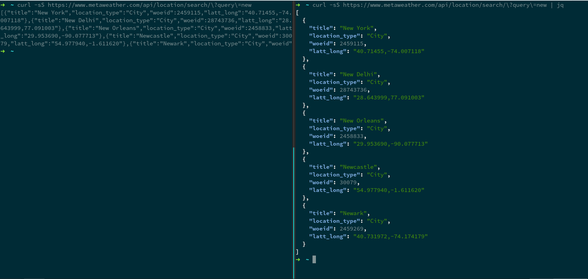
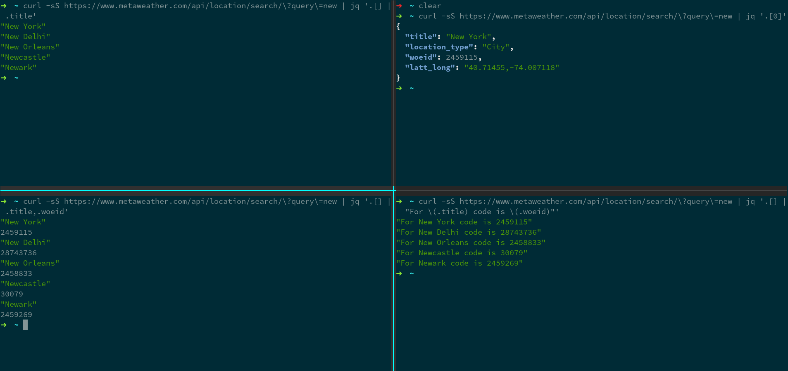
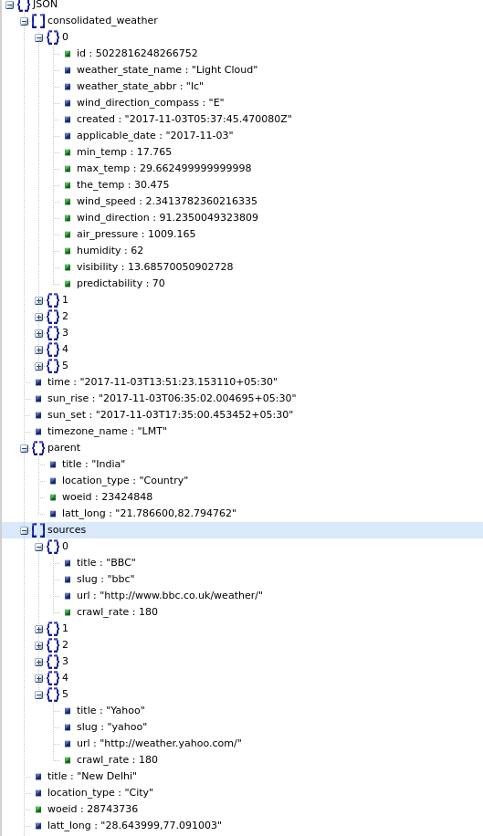
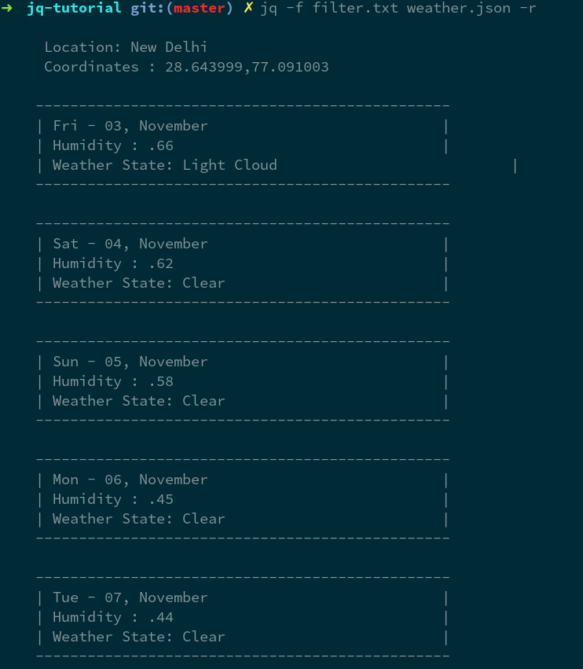

# jq-tutorial
Sample Examples for Jq article - OSFY December '17 Edition


## Examples

##### Fetch raw json using curl 

```bash 
curl -sS https://www.metaweather.com/api/location/search/?query=new 
```

Output:

```json
[{"title":"New York","location_type":"City","woeid":2459115,"latt_long":"40.71455,-74.007118"},{"title":"New Delhi","location_type":"City","woeid":28743736,"latt_long":"28.643999,77.091003"},{"title":"New Orleans","location_type":"City","woeid":2458833,"latt_long":"29.953690,-90.077713"},{"title":"Newcastle","location_type":"City","woeid":30079,"latt_long":"54.977940,-1.611620"},{"title":"Newark","location_type":"City","woeid":2459269,"latt_long":"40.731972,-74.174179"}]
```

##### Prettify using Jq

```bash
curl -sS https://www.metaweather.com/api/location/search/?query=new 
```

Output:

```json
[
  {
    "title": "New York",
    "location_type": "City",
    "woeid": 2459115,
    "latt_long": "40.71455,-74.007118"
  },
  {
    "title": "New Delhi",
    "location_type": "City",
    "woeid": 28743736,
    "latt_long": "28.643999,77.091003"
  },
  {
    "title": "New Orleans",
    "location_type": "City",
    "woeid": 2458833,
    "latt_long": "29.953690,-90.077713"
  },
  {
    "title": "Newcastle",
    "location_type": "City",
    "woeid": 30079,
    "latt_long": "54.977940,-1.611620"
  },
  {
    "title": "Newark",
    "location_type": "City",
    "woeid": 2459269,
    "latt_long": "40.731972,-74.174179"
  }
]

```


##### Display first element of array

```bash 
curl -sS https://www.metaweather.com/api/location/search/?query=new | jq '.[0]'
```

Output: 

```bash
{
  "title": "New York",
  "location_type": "City",
  "woeid": 2459115,
  "latt_long": "40.71455,-74.007118"
}
```

##### Display City Names for all

```bash
curl -sS https://www.metaweather.com/api/location/search/?query=new | jq '.[] | .title'
```

Output:

```bash
"New York"
"New Delhi"
"New Orleans"
"Newcastle"
"Newark"
```

##### Display City Names along with ID for all 
```bash
curl -sS https://www.metaweather.com/api/location/search/\?query\=new | jq '.[] | .title,.woeid'
```

Output:

```bash
"New York"
2459115
"New Delhi"
28743736
"New Orleans"
2458833
"Newcastle"
30079
"Newark"
2459269
```

##### String Interpolation

```bash
curl -sS https://www.metaweather.com/api/location/search/\?query\=new | jq '.[] |  "For \(.title) code is \(.woeid)"'
```

Output:

```bash
"For New York code is 2459115"
"For New Delhi code is 28743736"
"For New Orleans code is 2458833"
"For Newcastle code is 30079"
"For Newark code is 2459269"
```



##### Filter by City Name 

```bash
curl -sS https://www.metaweather.com/api/location/search/\?query\=new | jq ' .[] | select(.title == "New Delhi") '
```

Output:

```json
{
  "title": "New Delhi",
  "location_type": "City",
  "woeid": 28743736,
  "latt_long": "28.643999,77.091003"
}
```


##### Get New Delhi info

```bash
curl -sS https://www.metaweather.com/api/location/28743736/ > weather.json
```


`jq weather.json`



JSON data looks like this

```json
{ "consolidated_weather": [{ "id": 5022816248266752, "weather_state_name": "Light Cloud", "weather_state_abbr": "lc", "wind_direction_compass": "E", "created": "2017-11-03T05:37:45.470080Z", "applicable_date": "2017-11-03", "min_temp": 17.765000000000001, "max_temp": 29.662499999999998, "the_temp": 30.475000000000001, "wind_speed": 2.3413782360216335, "wind_direction": 91.235004932380903, "air_pressure": 1009.165, "humidity": 62, "visibility": 13.68570050902728, "predictability": 70 }, { "id": 6148716155109376, "weather_state_name": "Clear", "weather_state_abbr": "c", "wind_direction_compass": "ENE", "created": "2017-11-03T05:37:49.069990Z", "applicable_date": "2017-11-04", "min_temp": 16.75, "max_temp": 29.015000000000001, "the_temp": 28.399999999999999, "wind_speed": 2.563454464002227, "wind_direction": 65.523998048505675, "air_pressure": 1011.425, "humidity": 61, "visibility": 14.176583750894775, "predictability": 68 }, { "id": 5394481511661568, "weather_state_name": "Clear", "weather_state_abbr": "c", "wind_direction_compass": "NE", "created": "2017-11-03T05:37:51.308960Z", "applicable_date": "2017-11-05", "min_temp": 16.147500000000001, "max_temp": 29.145, "the_temp": 28.52, "wind_speed": 1.9995695890022269, "wind_direction": 55.629887662130905, "air_pressure": 1011.23, "humidity": 58, "visibility": 14.884325538853098, "predictability": 68 }, { "id": 5008438039937024, "weather_state_name": "Clear", "weather_state_abbr": "c", "wind_direction_compass": "NNW", "created": "2017-11-03T05:37:54.057620Z", "applicable_date": "2017-11-06", "min_temp": 15.147499999999999, "max_temp": 28.475000000000001, "the_temp": 27.710000000000001, "wind_speed": 2.0043574431380735, "wind_direction": 329.49548535486031, "air_pressure": 1009.39, "humidity": 45, "visibility": 15.533658434741112, "predictability": 68 }, { "id": 5268265844604928, "weather_state_name": "Clear", "weather_state_abbr": "c", "wind_direction_compass": "NE", "created": "2017-11-03T05:37:57.557410Z", "applicable_date": "2017-11-07", "min_temp": 15.094999999999999, "max_temp": 28.572500000000002, "the_temp": 27.359999999999999, "wind_speed": 1.6713582797602005, "wind_direction": 44.360763590360797, "air_pressure": 1008.04, "humidity": 43, "visibility": 15.74368189771733, "predictability": 68 }, { "id": 5077392934567936, "weather_state_name": "Clear", "weather_state_abbr": "c", "wind_direction_compass": "NNW", "created": "2017-11-03T05:37:59.980450Z", "applicable_date": "2017-11-08", "min_temp": 14.282500000000001, "max_temp": 28.142499999999998, "the_temp": 23.460000000000001, "wind_speed": 1.4269034173758584, "wind_direction": 335.43793586699337, "air_pressure": 1002.67, "humidity": 47, "visibility": null, "predictability": 68 }], "time": "2017-11-03T13:51:23.153110+05:30", "sun_rise": "2017-11-03T06:35:02.004695+05:30", "sun_set": "2017-11-03T17:35:00.453452+05:30", "timezone_name": "LMT", "parent": { "title": "India", "location_type": "Country", "woeid": 23424848, "latt_long": "21.786600,82.794762" }, "sources": [{ "title": "BBC", "slug": "bbc", "url": "http://www.bbc.co.uk/weather/", "crawl_rate": 180 }, { "title": "Forecast.io", "slug": "forecast-io", "url": "http://forecast.io/", "crawl_rate": 480 }, { "title": "Met Office", "slug": "met-office", "url": "http://www.metoffice.gov.uk/", "crawl_rate": 180 }, { "title": "OpenWeatherMap", "slug": "openweathermap", "url": "http://openweathermap.org/", "crawl_rate": 360 }, { "title": "World Weather Online", "slug": "world-weather-online", "url": "http://www.worldweatheronline.com/", "crawl_rate": 360 }, { "title": "Yahoo", "slug": "yahoo", "url": "http://weather.yahoo.com/", "crawl_rate": 180 }], "title": "New Delhi", "location_type": "City", "woeid": 28743736, "latt_long": "28.643999,77.091003", "timezone": "Asia/Kolkata" }
```

##### Range on Arrays 

```bash
jq 'range(0;([.sources[]] | length)) as $i | " \(.sources[$i] .title) predicts \(.consolidated_weather[$i] .weather_state_name)"' weather.json
```

Output:

```bash
" BBC predicts Light Cloud"
" Forecast.io predicts Clear"
" Met Office predicts Clear"
" OpenWeatherMap predicts Clear"
" World Weather Online predicts Clear"
" Yahoo predicts Clear"
```

##### Combining everything

filter program

```bash
# Formate Date
# This function takes value via Pipe (|) operator
 def format_date(x): 
    x |strptime("%Y-%m-%d") | mktime | strftime("%a - %d, %B");

def print_location:
    . | "
     Location: \(.title) 
     Coordinates : \(.latt_long)   ";

def print_data:
    . | "
    ------------------------------------------------
    | \(format_date(.applicable_date))\t\t           |
    | Humidity : .\(.humidity)\t\t                   |
    | Weather State: \(.weather_state_name)\t\t\t   |
    ------------------------------------------------";

def process_weather_data:
    . | sort_by(.applicable_date)[] | print_data;

. as $root | print_location, (.consolidated_weather | process_weather_data)
```

Run it with 

```bash
jq -f filter.txt weather.json -r
```

Output:

```bash
Location: New Delhi 
     Coordinates : 28.643999,77.091003   

    ------------------------------------------------
    | Fri - 03, November		                       |
    | Humidity : .66		                           |
    | Weather State: Light Cloud			             |
    ------------------------------------------------

    ------------------------------------------------
    | Sat - 04, November		                       |
    | Humidity : .62		                           |
    | Weather State: Clear			                   |
    ------------------------------------------------

    ------------------------------------------------
    | Sun - 05, November		                       |
    | Humidity : .58		                           |
    | Weather State: Clear			                   |
    ------------------------------------------------

    ------------------------------------------------
    | Mon - 06, November		                       |
    | Humidity : .45		                           |
    | Weather State: Clear			                   |
    ------------------------------------------------

    ------------------------------------------------
    | Tue - 07, November		                       |
    | Humidity : .44		                           |
    | Weather State: Clear			                   |
    ------------------------------------------------

    ------------------------------------------------
    | Wed - 08, November		                       |
    | Humidity : .47		                           |
    | Weather State: Clear			                   |
    ------------------------------------------------

```


